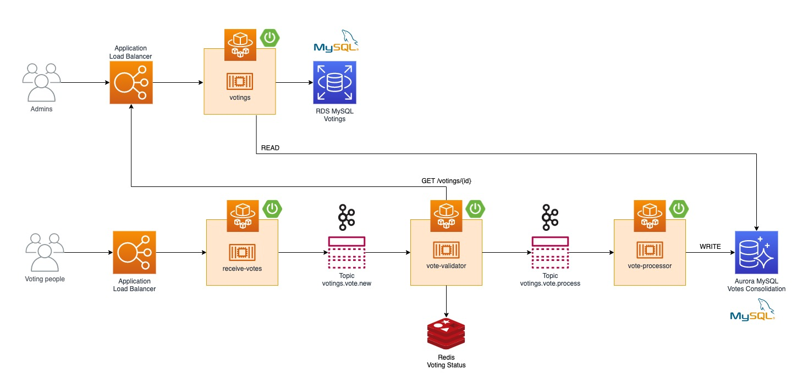

# voting-system

A high scalable cloud native voting system to handle requests with thousands transactions per seconds.

# Architecture


# Setup
```bash
$ docker-compose up
$ bash create_topics.sh
```

# Microservices
## Voting
Application responsible for managing votings.

## Receive votes
Receives votes by a REST endpoint and send request to a Kafka topic named `votings.votes.new` to be processed asynchronously.

## Validator
Validates votes by consulting the voting's current status and send valid votes to a Kafka topic named `votings.votes.process`.

# Try it
Check the [Postman Collection](voting_system.postman_collection.json) to make requests to the APIs.